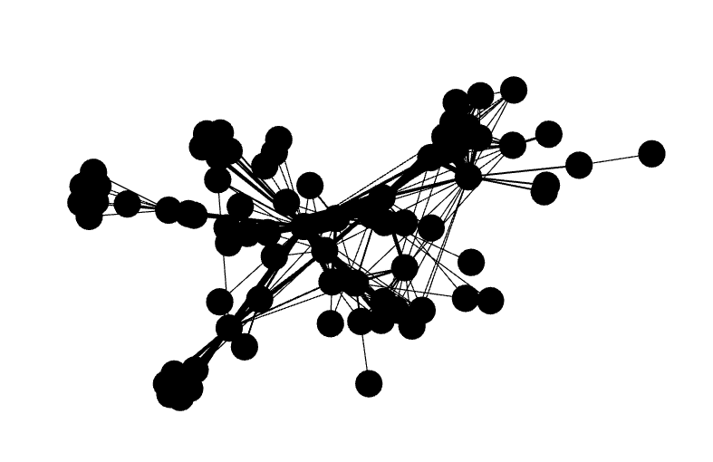
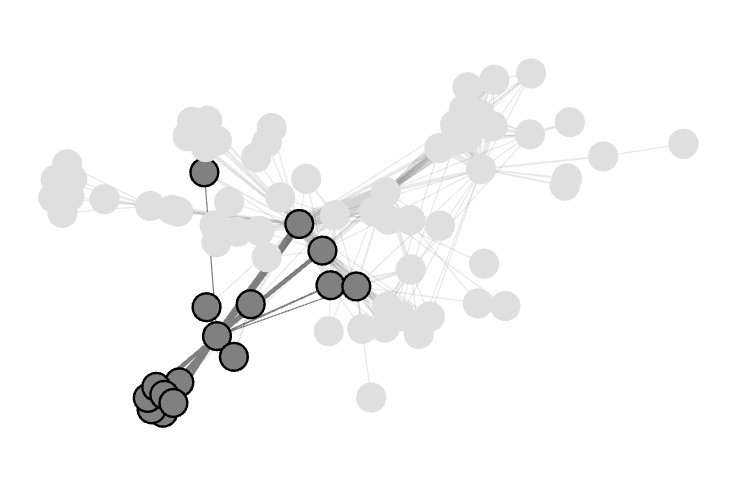
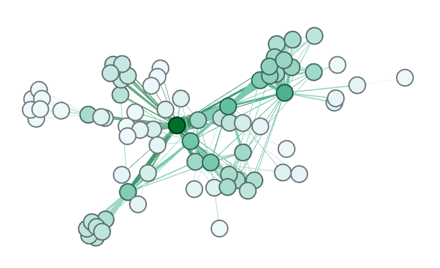

# CompJournalism HW5
Chi-An Wang(cw2897)
### Part 3
##### What do you see? Can you discern any patterns?
The graph is kind of messy, but by observing in detail, we can see that there is one node in the graph(the right part of the graph) that most other nodes are connected to. There are also several edges that are slightly thicker than all other edges. It probably means that these are the main characters and the one that has the most adjacent nodes, should be the star. There are also several nodes that only has one edge, I bet they only appeared once or twice in the show.


### Part 4
#### Result of running `ForceAtlas 2`



### Part 6
I wouldn't say I am really familiar with the story but I've seen it once. But it is obvious that the plot is centered around *Jean Valjean*.

#### Focusing on the center node, *Jean Valjean* in `ForceAtlas 2` mode.


#### Focusing on *Javert*


#### Focusing on *Fantine*


#### Focusing on *Cosette*


Although *Fantine* is also listed as one of the majors, but it's position is not really centered. Otherwise, most of them are centered.


### Part 7
##### Do these high degree nodes correspond to the nodes that the layout algorithm put in the center? Are they the main characters in the story?
The graph looks like the following.


The darkest is indeed the major character *Valjean*. The second darkest is *Gavroche*. Several other nodes slightly brighter are also the main characters. Because the color is set according to the number of `degree` they have, so it makes sense to map the color to the importance of that character.


### Part 8
##### Betweenness Centrality


The `bewteenness graph` still highlighted *Valjean* as the darkest vertex but unlike the `degree` graph, the other oustanding darker nodes are different. This time it included *Myriel*, *Gavroche*, *Marius*, *Fantine*. According to the definition on wikipedia:
```
Betweenness centrality is an indicator of a node's centrality in a network. 
It is equal to the number of shortest paths from all vertices to all others 
that pass through that node.
```
It also says that:
```
Quantifies the number of times a node acts as a bridge along the shortest path between 
two other nodes.
```

Meaning that the darker a node is, it probably appeared in more chapters so that probably most people have talked to them and that the story is mainly about them. For me, I feel like as long as you are connected to *Valjean* in the graph(even if a node is only connected to Valjean) will have similar `betweenness centrality` value. I think that is why unless you're really a major character and is also connected to a lot of nodes, there's not much difference between all other minor nodes. That's also the difference between the `degree` graph and `betweenness centrality` graph. Since a lot of nodes are painted with a darkness between *Valjean* and other unpopular nodes in `degree`, however, this kind of color group kind of disappeared in `Betweenness Centrality` graph.
This would be a good algorithm to identify who are really the characters that connects to a lot of people.


##### Closesness Centrality

According to Wikipedia:
```
In a connected graph, the normalized closeness centrality (or closeness) of a node is 
the average length of the shortest path between the node and all other nodes in the 
graph. Thus the more central a node is, the closer it is to all other nodes.
```

Compared to `Betweenness Centrality`, which measures how well a connection path you are, `Closeness Centrality` measures how well we are linked with all other nodes. So we can imagine two group of nodes that both has a center node that all the nodes in that group are connected to, and there is one bridge node that connects the two group but is only connected to two nodes(one on both sides). The value of `betweenness centrality` for this bridge node would be really high but compared to the two central nodes of each group, but they two might have a higher `closeness centrality` value. 


I would say that *Gribier* and *Myriel* seems to have not change their color a lot.


### Part 9
##### Which centrality algorithm would you prefer to use to understand the structure of Les Miserables? Why? How would you validate your choice if you didn’t already know the story?

I think first, we'll have to define how do you mean by understand Les Miserable? Is it to understand the relationship between all the characters? Or is it to understand the plot and the lineups? (Might be writing stories about their backstage organizing and logistic...) Or is it to understand which character is the major character in this plot?

Without prioir knowledge, I think I would first start with the `degree` centrality algorithm(does it even count as an algorithm?). Since I know what is the data, just seeing the visualization gives me a sense of which node appeared the most and have the most common appearing characters. I can have a general guess about who are the main characters. After that, I might want to know, what these clusters are and how are they related to the center character. This moment, I might take a look at the `Closeness Centrality` graph, to narrow down on some of the main players in each cluster. 

However, `degree` only measures how many adjacent nodes they have. I might be concerned that if there's a scene with a bunch of people so they are all mutually connected, but they don't really have a strong connection with the main character, or only one of them are strongly related to the main branch of the plot. By using `Closeness Centrality` algorithm I think we can have a better view about who are the most important roles by using this kind of graph visualization.

By observing `Closeness Centrality`, we can kind of have a grasp about 
1. how many nodes this node is connected to and
2. how well this node is connected to all other nodes
Which in my opinion, sort of represents the importance of a character in a plot.

| Name   | Closeness Centrality |
|--------|----------------------|
| Valjean| 0.644                |
| Marius | 0.531                |
| Javert | 0.517                |
| Thenardier| 0.517             |
| Gavroche  | 0.513             |

By picking up some of the characters with top `Closeness Centrality`, they matched pretty well with the major characters in the give [Wiki page](https://en.wikipedia.org/wiki/Les_Misérables#Plot).


By observing `Betweeness Centrality`, we can make a guess about, whether this person is a main character in certain chapters. For example, if one person has a high `betweeness centrality`, it probably means that a lot of people has to go through this node in order to connect to all other nodes. For example, *Myriel* itself is connected to 7 other nodes that is not connected to any other people. Meaning this bridge node might have it's own starring chapter. If one character has it's own starring chapter I think it is fair to say that this character is sort of important. 


